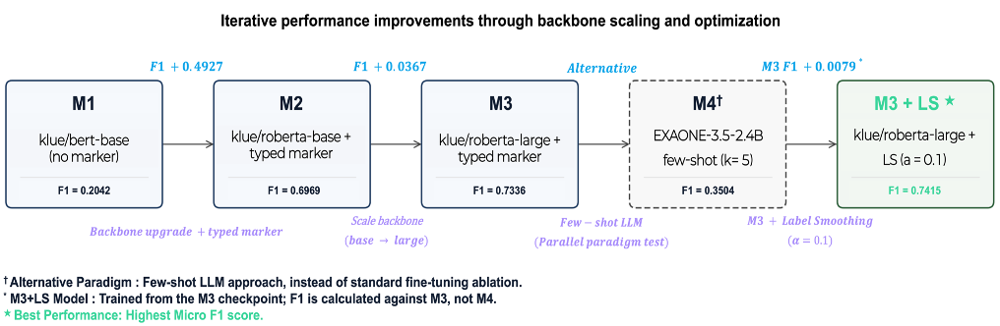
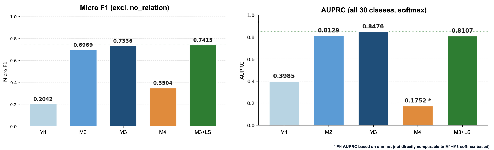

# KLUE Relation Extraction

## 개요
- KLUE RE(Relation Extraction) 데이터셋을 활용해 4개 모델(M1~M4)을 설계·학습·비교하고,오류 분석 및 개선 실험까지 수행한 전 과정을 기록한 노트북

## 실험 설계 (Model Pipeline)

## 노트북 구조
| Section | 내용 |
|---------|------|
| 0 | 환경설정 / 상수 / 평가함수 |
| 1 | EDA — 탐색적 데이터 분석 |
| 2 | 전처리 — Typed Entity Marker |
| 3 | M1 — klue/bert-base (기준선) |
| 4 | M2 — klue/roberta-base + typed marker |
| 5 | M3 — klue/roberta-large + typed marker |
| 6 | M4 — EXAONE-3.5-2.4B few-shot + LLM 선정 근거 |
| 7 | M1~M4 전체 비교 |
| 8 | 오류 분석 |
| 9 | 개선 실험 — Label Smoothing α=0.1 |
| 10 | 결론 / 한계 / 다음 단계 |

## 평가 기준 (KLUE RE 공식)
- Micro F1: no_relation(label 0) 제외한 29개 클래스 기준
- AUPRC   : 전체 30개 클래스 포함, softmax 확률 기반

## 모델
| 모델 | 방식 | 이유 |
|---|---|---|
| M1 | 실제 재학습 | bert-base, batch=32 -> T4×2에서 약 20~30분. 가능 |
| M2 | 실제 재학습 | roberta-base, batch=32 -> T4×2에서 약 30~40분. 가능 |
| M3 | checkpoint 로드 | roberta-large 5 epoch -> 4~6시간. 재학습 불가 |
| M4 | preds.npy 로드 | EXAONE 전체 추론 -> 383분. 재학습 불가 |
| M3+LS | checkpoint 로드 | M3 기반 3 epoch 추가 -> 2~3시간. 재학습 불가 |

## Result (Micro F1, AUPRC)

